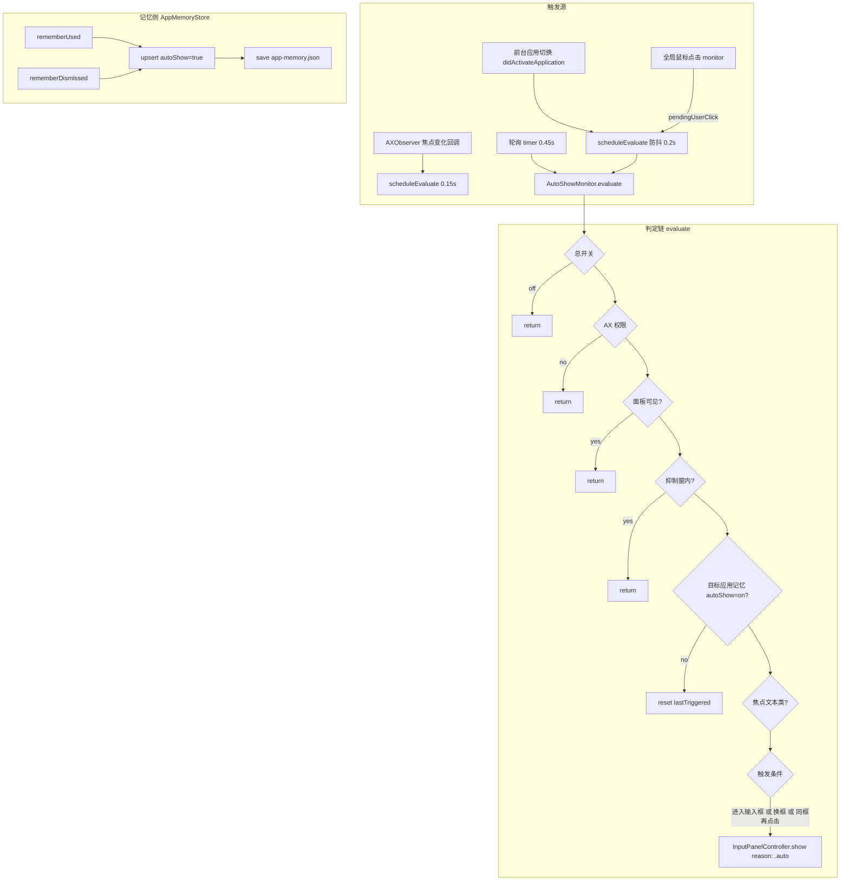

# 自动弹出（AutoShow）领域知识库

## §0 文档索引

| § | 标题 | 定位 |
|---|------|------|
| §1 | 业务背景与核心概念 | 首次接触该域时读 |
| §1.5 | 架构概览 | 快速建立分层认知（mermaid 图） |
| §2 | AutoShow 触发判定状态机 | 理解判定链与防抖 |
| §2.5 | 物理路径速查 | 直接定位代码目录 |
| §3 | 代码入口索引 | 按任务场景找入口 |
| §4 | 应用记忆数据字段索引 | 改记忆读取时 |
| §5 | 事件与监听入口索引 | 改事件驱动逻辑时 |
| §6 | 核心业务规则与隐性约束 | 改代码前必扫的 AI 易错点 |
| §7 | 常见易忽略条件与验证路径 | 改完后如何验证 |
| §8 | 关联文档 | 跨域联读指引 |
| §9 | 覆盖度与待补充项 | 置信度与缺口 |

## §1 业务背景与核心概念

「按应用记忆自动弹出」：OpenInput 记住哪些应用的用户「用过后想自动弹出小窗」，当前台应用聚焦到输入框时自动呼出面板。**应用记忆是双向的**：成功粘贴文本 → 自动开启该应用的自动弹出；主动关闭（esc / ✕ / 热键）→ 自动关闭该应用的自动弹出。用户也可在设置页管理。

核心概念：

- **应用记忆（AppMemory）**：`RememberedApp` 列表 + 全局总开关 `autoShowMasterEnabled`。
- **触发判定链（evaluate）**：总开关 → AX 权限 → 面板未显示 → 抑制窗 → 应用记忆匹配 → 焦点在文本输入框 → 触发条件（进入输入框 / 切换输入框 / 同框重击）→ 显示。
- **焦点评分（focusSignature）**：`pid|role|description|title|position` 归一化签名，判断「同一个输入框」。
- **抑制（suppressBriefly）**：提交/主动关闭后短时间内不自动弹。

## §1.5 架构概览

## §2 触发流程判定状态机（AutoShowMonitor.evaluate）

前置四条硬闸门，全部通过才继续：

1. `AppMemoryStore.shared.autoShowMasterEnabled == true`
2. `AccessibilityPermission.isTrusted == true`
3. `InputPanelController.shared.isVisible == false`（面板已在屏上就不重复弹）
4. `Date() >= suppressUntil`（抑制窗内不弹）

然后：

1. 目标应用 = `FocusTracker.resolveTargetApplication()` ?? 前台应用；非本应用。
2. 若 AX observer 未附着在该 pid，`attach(to:)` 重新注册（Observer 跟随前台应用）。
3. `AppMemoryStore.shouldAutoShow(bundleIdentifier:)` 为 false → 重置状态并 return。
4. `focusedTextFieldInfo(pid:)` 得到聚焦文本类元素签名（nil 表示不在输入框）。
5. 触发三条件（对同一焦点签名防抖）：
   - 从非输入区**进入输入框**（`wasInTextField` false → true）→ 触发；
   - **切换到另一个输入框**（签名变化）→ 触发；
   - **同一输入框再次点击**（`pendingUserClick` true 且距上次自动弹出 >1s；Chrome 等不常发 AX 通知的应用）→ 触发。
6. 触发 → `show(reason: .autoShow)`。

焦点离开输入框时 `lastTriggeredFocusSignature = nil`，复位状态。

### 焦点识别（focusedTextFieldInfo）

向上追溯最多 6 层祖先（Chrome 地址栏聚焦可能落在内层节点）；判定文本类（isTextLike）：AXRole ∈ {TextField/TextArea/ComboBox/SearchField/URLField}，或 subrole/AXEditable/AXSelectedTextRange 存在，或启发式 omnibox 关键词（address/omnibox/url/搜索/地址）、有 AXValue 且字符数属性存在等。

## §2.5 物理路径速查

| 目录（相对项目根） | 内容 | 关键类/文件数 |
|---|---|---|
| `OpenInput/Services/AutoShowMonitor.swift` | 监控/判定/抑制 | AutoShowMonitor |
| `OpenInput/Services/AppMemoryStore.swift` | 应用记忆实现 | AppMemoryStore |

## §3 代码入口索引

| 场景 | 入口 | 类/方法 | 说明 |
|---|---|---|---|
| 启动监控 | `AppDelegate.applicationDidFinishLaunching` | `AutoShowMonitor.shared.start()` | 注册三路监听 |
| 判定触发 | `AutoShowMonitor.evaluate()` | 内部 `AppMemoryStore` 查询 | 含防抖 |
| 应用记忆查询 | `AppMemoryStore.shouldAutoShow(bundleIdentifier:)` | 全局开关+记忆列表 | 两者均为 true 才返回 true |
| 记忆写入（成功注入） | `InputPanelController.submitAndHide` | `rememberUsed` | 自动开 |
| 记忆写入（主动关） | `InputPanelController.dismiss` | `rememberDismissed` | 自动关 |
| 用户管理 | 设置页 AutoShowSettingsView | `setAutoShow`/`remove`/`clear` | 逐应用开关 |

## §4 数据字段入口索引

| 字段 | 宿主 | 业务语义 | 改动注意 |
|---|---|---|---|
| `autoShowMasterEnabled` | AppMemoryStore | 总开关，UserDefaults 键 `appMemory.autoShowMaster` | 默认 true |
| `apps` | AppMemoryStore | `[RememberedApp]` JSON 持久化 | 文件 `App Support/OpenInput/app-memory.json` |
| `RememberedApp.appName` | 记忆条目 | 展示名 | 用于设置页标题 |
| `RememberedApp.autoShow` | 记忆条目 | 该应用是否自动弹 | 由 rememberUsed/Dismissed 自动翻转 |
| 抑制窗 `suppressUntil` | AutoShowMonitor | 弹窗后短暂静默 | suppressBriefly 默认 2s |

### 持久化

- `AppMemoryStore.load()/save()` 在应用启动时加载、每次变更后写盘（原子写入）。
- 失败路径：读取失败回退空列表（不崩溃、不删原文件）；写入失败记日志。

### 旧键迁移

- 旧键 `autoShowMasterEnabled` → 新键 `appMemory.autoShowMaster`（读旧写新删旧）。

## §5 事件与监听入口索引

| 类型 | 标识 | 代码入口 |
|---|---|---|
| 前台应用切换 | `NSWorkspace.didActivateApplicationNotification` | `AutoShowMonitor.start` 内部 appObserver |
| 全局鼠标左/右键 | 全局事件监视 | `NSEvent.addGlobalMonitorForEvents` |
| AX 焦点变化 | `kAXFocusedUIElementChanged` / `kAXFocusedWindowChanged` / `kAXSelectedTextChanged` | AXObserver 回调 |
| 轮询 | `Timer` 0.45s | `AutoShowMonitor` |

## §6 核心业务规则与隐性约束

- **AI 易错点**：所有回调必须 `DispatchQueue.main.async` 桥回 MainActor，禁止在回调内 `Task { @MainActor }`（Carbon/AX 回调线程 → SIGSEGV）。
- 【禁止】在 `evaluate` 中直接 `InputPanelController.shared.show()`——必须先过四条门控（总开关/权限/可见性/抑制窗）。
- 【禁止】把 `suppressUntil` 改成永久抑制——AutoShow 是产品主动呼出，抑制只用于防「弹窗→用户操作→又弹」的循环。
- 【隐性】`AppMemoryStore.rememberDismissed` 与 `submitAndHide` 里的 `rememberUsed` 必须成对维护：用户关闭行为会关掉自动弹，误写会把记忆翻转。
- 【隐性】AXObserver `attach` 的 `refcon` 常规：`Unmanaged.passUnretained(self).toOpaque()` 回调里 `takeUnretainedValue`——不能持有强引用防循环引用。
- 【隐性】`detach` 时先移除 AXObserver 通知与 runloop source，再置空 `axObserver`/`observedPID`，否则留僵尸回调。
- 【叫法统一】「自动弹出」主称谓；代码中 `shouldAutoShow`/`scheduleEvaluate`/`evaluate`；「抑制」= `suppressBriefly`。
- 【低置信】0.45s 轮询间隔与 0.2s 防抖属于经验值，无依据注释。

## §7 常见易忽略条件与验证路径

- 验证自动弹：打开设置 → 应用记忆 toggle 开启某 app（例如「备忘录」）→ 聚焦备忘录输入框 → 面板应自动出现。
- 验证不开：同一应用 esc 关闭 → 再聚焦不应自动弹（`rememberDismissed` 已设 false）；在设置页开关重新打开后可再弹。
- 验证防抖：面板展开时反复点击文本框 → 不应重复弹窗（`isVisible` 门控）；关闭后 1~2s 抑制窗内聚焦也不弹。
- 检查日志：应用记忆写入可在 `Console.app → com.x0c.openinput` 查看失败记录（`AppMemoryStore` logger）。

## §8 关联文档

- [输入小窗知识库](INPUT_PANEL_KNOWLEDGE_BASE.md)：面板显示链路（触发源之一）。
- [焦点捕获与文本注入知识库](FOCUS_INJECTION_KNOWLEDGE_BASE.md)：`resolveTargetApplication` 共用。
- [偏好设置知识库](PREFERENCES_KNOWLEDGE_BASE.md)：记忆开关与键迁移。
- [Accessibility Guide](ACCESSIBILITY_GUIDE.md)：AXObserver 生命周期、坐标转换。

## §9 覆盖度与待补充项

- 代码覆盖率：触发判定链、抑制、记忆读写、设置页管理全部覆盖。
- 待确认：不同应用的聚焦通知可靠性排序（Chrome 通知不可靠的注释是真实经验）。
- 待补充：实际用户的使用反馈（「哪些应用该自动弹是最烦的」这类产品经验）。

<!-- 该文档由 doc-init 生成于 2026-08-08；定位：AI 修改自动弹出判定/记忆/抑制逻辑时快速参考 -->