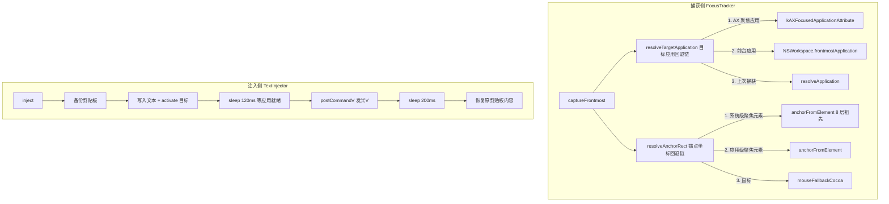

# 焦点捕获与文本注入领域知识库

## §0 文档索引

| § | 标题 | 定位 |
|---|------|------|
| §1 | 业务背景与核心概念 | 首次接触该域时读 |
| §1.5 | 架构概览 | 快速建立分层认知（mermaid 图） |
| §2 | 捕获/注入核心流程 | 理解回退链与注入时序 |
| §2.5 | 物理路径速查 | 直接定位代码目录 |
| §3 | 代码入口索引 | 按任务场景找入口 |
| §4 | 数据字段入口索引 | 改数据结构时 |
| §5 | 事件与监听入口索引 | 改事件驱动逻辑时 |
| §6 | 核心业务规则与隐性约束 | 改代码前必扫的 AI 易错点 |
| §7 | 常见易忽略条件与验证路径 | 改完后如何验证 |
| §8 | 关联文档 | 跨域联读指引 |
| §9 | 覆盖度与待补充项 | 置信度与缺口 |

## §1 业务背景与核心概念

小窗显示时要知道「把文本还给谁、显示在哪」：目标输入框捕获（AX 焦点解析）确定目标应用与锚点；提交时通过「激活目标应用 + ⌘V」把文本注入回原输入框。

核心概念：

- **目标应用（target）**：被捕获的 `NSRunningApplication`，小窗显示期间固定不变。
- **锚点（anchorRect）**：目标输入框在 AppKit 屏幕坐标系（左下原点）的矩形，供面板定位。
- **AX 焦点解析回退链**：从系统级聚焦元素 → 目标应用聚焦元素 → 鼠标位置，逐级降级。
- **注入方式**：目前只有剪贴板粘贴（⌘V）一种，`InsertionMethod.typing` 在设置里存在但未启用。

## §1.5 架构概览



## §2 捕获/注入核心流程

### 2.1 目标应用回退链（`FocusTracker.resolveTargetApplication`）

1. AX 聚焦应用（`kAXFocusedApplicationAttribute`，需权限）→ 非本应用则采用。
2. `NSWorkspace.shared.frontmostApplication` → 非本应用则采用。
3. 上次捕获的应用（`resolveApplication` 从 bundleId/pid 反查，应用可能已重启）。
4. 全失败 → nil（不显示面板）。

### 2.2 锚点坐标回退链（`FocusTracker.resolveAnchorRect`）

1. 无权限 → 直接鼠标位置。
2. 系统级聚焦元素 `kAXFocusedUIElementAttribute` → `anchorFromElement`。
3. 目标应用自身的聚焦元素 `AXUIElementCreateApplication(pid)` → `anchorFromElement`。
4. 鼠标位置（`mouseFallbackCocoa`：鼠标上方 8pt 高 16pt 的窄条）。

### 2.3 anchorFromElement 判定树

从聚焦元素向上追溯最多 8 层祖先，每层：
1. 光标边界（`kAXSelectedTextRange` + `kAXBoundsForRangeParameterizedAttribute`）优先，返回光标矩形（过窄补 2pt 宽、16pt 高）。
2. 元素自身 frame（`kAXPosition`+`kAXSize`），宽高 >2pt 且是文本角色（TextField/TextArea/ComboBox/SearchField）或高度 <64 → 返回。
3. 否则上溯父级继续。

超宽元素（>280pt，如 Chrome 地址栏）`pinchWide` 收敛到鼠标附近 48pt 宽。

### 2.4 注入时序（TextInjector.inject）

```text
t0   备份剪贴板 string
t1   写入新文本
t2   target.activate() 激活目标应用
t2+120ms  发 ⌘V（CGEvent 键盘事件）
t2+320ms  恢复剪贴板
```

失败路径（`InjectError`）：无目标 / 无权限 / 空文本。

## §2.5 物理路径速查

| 目录（相对项目根） | 内容 | 关键类/文件数 |
|---|---|---|
| `OpenInput/Services/` | 焦点捕获/注入/权限 | FocusTracker.swift / TextInjector.swift / AccessibilityPermission.swift |
| `OpenInput/Models/` | 捕获数据模型 | AppPreferences.swift（CapturedFocus） |

## §3 代码入口索引

| 场景 | 入口 | 类/方法 | 说明 |
|---|---|---|---|
| 捕获当前目标 | 面板显示前 | `FocusTracker.captureFrontmost` | 记录 pid/bundleId/名称/锚点 |
| 取目标应用 | 注入前 | `FocusTracker.resolveTargetApplication` | 三级回退链 |
| 注入文本 | 提交后 | `TextInjector.inject(_:into:)` | 剪贴板 + ⌘V 异步 |
| 读当前焦点框文字 | 还原上次清理前 | `FocusTracker.focusedFieldValue` | 读不到则不拦还原；读到且已变则拒绝 |
| 请求权限 | 授权引导 | `AccessibilityPermission.requestIfNeeded` | 弹系统授权框 |
| 打开系统设置 | 权限缺失时 | `AccessibilityPermission.openSystemSettings` | 打开辅助功能设置页 |

## §4 数据字段入口索引

| 字段 | 宿主 | 业务语义 | 改动注意 |
|---|---|---|---|
| `CapturedFocus` | `FocusTracker` | 目标应用 + 锚点快照 | 面板隐藏后仍保留，供下次复用 |
| `anchorRect` | `CapturedFocus` | AppKit 屏幕坐标矩形 | 必须转 Cocoa 坐标系后才能用 |
| `bundleIdentifier` | `CapturedFocus` | 应用标识 | 用于应用记忆键 |
| `InsertionMethod` | `PreferencesStore` | paste/typing | typing 未启用 |

## §5 事件与监听入口索引

| 类型 | 标识 | 代码入口 |
|---|---|---|
| AX 权限检查 | `AXIsProcessTrusted` | `AccessibilityPermission.isTrusted` |
| 应用切换后重锚定 | `didActivateApplication` | `InputPanelController.installAutoHideMonitors` |
| 注入完成 | Task 回调 | `InputPanelController.submitAndHide` |

## §6 核心业务规则与隐性约束

- **AI 易错点**：AX 坐标是左上原点，AppKit 是左下原点，`FocusTracker.axToCocoa` 用 `NSScreen.screens.max(\.frame.maxY)` 翻转 Y 轴。**新增任何 AX 坐标使用必须经过该转换**。
- **AI 易错点**：`anchorFromElement` 只向上追溯 8 层——祖先链超过 8 层（深层嵌套的 WebView 内容）会放弃锚点退到鼠标位置。
- 【禁止】注入时 `NSPasteboard.general` 直接覆盖——必须先备份再恢复，否则破坏用户剪贴板。
- 【隐性依赖】`captureFrontmost` 必须在显示面板前调用（`InputPanelController.show` 第一步）——否则注入时 `resolveApplication` 拿到 nil。
- 【隐性】`activate()` 后固定 sleep 120ms 再发 ⌘V：太短应用未就绪、太长延迟明显。修改需真机验证。
- 【隐性】目标应用已退出（崩溃/关闭）时 `resolveApplication` 可能返回死进程，注入静默失败——`inject` 的 `noTarget` 只在 target 为 nil 时触发。
- 【叫法统一】「目标应用」= `CapturedFocus`/`resolveTargetApplication` 的返回值；「锚点」= anchorRect。

## §7 常见易忽略条件与验证路径

- 验证回退链：无辅助功能权限时启动 → 面板应出现在鼠标附近（锚点=鼠标）。
- 验证注入：打开「备忘录」单行输入框 → `⌘⌥I` 呼出 → 输入文本 → Return → 文本应出现在原输入框，且剪贴板内容恢复为操作前的值。
- 权限拒绝时：提交应弹错误 Alert，且文本被放入剪贴板兜底（用户可手动 ⌘V）。
- 注意：剪贴板恢复是 320ms 后执行——若用户在恢复前复制了其他内容会被覆盖。

## §8 关联文档

- [语音听写知识库](VOICE_INPUT_KNOWLEDGE_BASE.md)：提交清理后的注入与还原时读焦点框。
- [输入小窗知识库](INPUT_PANEL_KNOWLEDGE_BASE.md)：面板定位用锚点、提交流程入口。
- [自动弹出知识库](AUTO_SHOW_KNOWLEDGE_BASE.md)：自动弹出也用 `resolveTargetApplication`。
- [Accessibility 机制 Guide](ACCESSIBILITY_GUIDE.md)：AX 权限、Observer、坐标转换。
- [运行与验证 Guide](OPERATIONS_GUIDE.md)：运行验证套路。

## §9 覆盖度与待补充项

- 覆盖：回退链、坐标转换、注入时序、剪贴板保护、失败分支、还原前读焦点框。
- 待补充：Chrome 地址栏等特殊应用的实测锚点效果（需要运行验证）。
- 低置信：120ms/200ms 时序参数来源（代码内无注释依据，属经验值）。

<!-- 该文档由 doc-init 生成于 2026-08-08；定位：AI 修改焦点捕获/坐标转换/文本注入时快速参考 -->