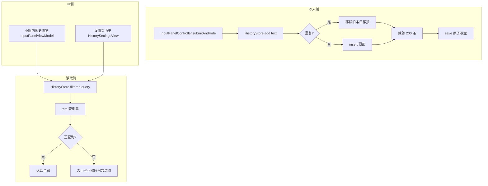

# 历史记录领域知识库

## §0 文档

| § | 标题 | 定位 |
|---|------|------|
| §1 | 业务背景与核心概念 | 首次接触该域时读 |
| §1.5 | 架构概览 | 快速建立分层认知（mermaid 图） |
| §2 | 历史存取核心流程 | 理解去重置顶与搜索过滤 |
| §2.5 | 物理路径速查 | 直接定位代码目录 |
| §3 | 代码入口索引 | 按任务场景找入口 |
| §4 | 数据字段入口索引 | 改数据结构时 |
| §5 | 流程/UI 入口索引 | 改集成界面时 |
| §6 | 核心业务规则与隐性约束 | 改代码前必扫的 AI 易错点 |
| §7 | 常见易忽略条件与验证路径 | 改完后如何验证 |
| §8 | 关联文档 | 跨域联读指引 |
| §9 | 覆盖度与待补充项 | 置信度与缺口 |

## §1 业务背景与核心概念

OpenInput 保存每次成功注入的历史文本，供用户在下次打开小窗时快速复用（面板内历史浏览）或在设置页中浏览/删除/复制。

核心概念：

- **历史条目（HistoryItem）**：文本 + 创建时间 + 唯一 ID，JSON 持久化到 `history.json`。
- **去重置顶（add 语义）**：重复文本不产生重复条目，而是「移回顶部」并刷新时间。
- **历史上限（maxItems）**：200 条，超出丢弃最旧。
- **搜索过滤（filtered）**：大小写不敏感的包含匹配（本地化 `localizedCaseInsensitiveContains`）。

## §1.5 架构概览

## §2 存取核心流程

### 添加（add）

1. `trimmingCharacters(in: .whitespacesAndNewlines)` 后为空 → 丢弃。
2. 已存在相同文本 → 移除旧条目并**移回顶部**（保留原 ID，刷新 createdAt），跳步骤 3。
3. 否则 insert 顶部、用当前时间。
4. 若 `items.count > 200` → 裁剪掉最旧（`prefix(200)`）。
5. `save()` 原子写盘。

### 删除

- `delete(_ id: UUID)` / `delete(at: IndexSet)` / `clear()`：均立即持久化。

### 搜索

- `filtered(query:)`：query trim 后为空 → 原列表；否则 `localizedCaseInsensitiveContains` 过滤。

## §2.5 物理路径速查

| 目录（相对项目根） | 内容 | 关键类/文件数 |
|---|---|---|
| `OpenInput/Services/HistoryStore.swift` | 持久化实现 | HistoryStore / HistoryItem |
| `OpenInput/UI/History/HistorySettingsView.swift` | 设置页历史管理 | HistorySettingsView |
| `OpenInput/UI/InputPanel/InputPanelView.swift` | 小窗内历史浏览 | InputPanelViewModel / HistoryPopoverView |

## §3 代码入口索引

| 场景 | 入口 | 类/方法 | 说明 |
|---|---|---|---|
| 添加历史 | `InputPanelController.submitAndHide` | `HistoryStore.shared.add` | 成功注入后调用 |
| 查询过滤 | 面板/设置页实时过滤 | `HistoryStore.filtered(query:)` | 大小写不敏感 |
| 小窗内浏览 | `InputPanelViewModel.handleHistoryUp/Down` | 面板内历史弹层 | ↑/↓ 上下切换 |
| 删除当前浏览项 | 面板内 ⌘⌫ | `InputPanelViewModel.deleteCurrentHistoryItem` | 仅历史浏览态 |
| 设置页管理 | `HistorySettingsView` | `store.delete/_clear` | 搜索+多选删除+清空 |
| 复制 | 设置页右键菜单 | `NSPasteboard.general` | 复制整条文本 |

## §4 数据字段入口索引

| 字段 | Host | 业务语义 | 改动注意 |
|---|---|---|---|
| `id` | HistoryItem | UUID 主键 | 删除/选择用 |
| `text` | HistoryItem | 历史文本 | 去重键；修改需防利旧匹配 |
| `createdAt` | HistoryItem | 记录时间 | 相对时间展示（RelativeDateTimeFormatter）|
| `maxItems` | HistoryStore | 200 条上限 | 修改上限需同时考虑性能 |
| `fileURL` | HistoryStore | `App Support/OpenInput/history.json` | 文件损坏回退空列表 |

## §5 组件与 UI 入口索引

| 类型 | 标识 | 代码入口 |
|---|---|---|
| 面板内置弹层 | HistoryPopoverView | 小窗内 ↑/点击时钟图标打开 |
| 设置页 | HistorySettingsView | 搜索框 + 列表 + 多选删除 |
| 显示格式 | HistoryItem.relativeTime | 相对时间跟随系统语言 |

## §6 核心业务规则与隐性约束

- **AI 易错点**：`add` 的去重是「完全同文本」——只差一个空格/大小写就会变成新条目；且去重会**刷新 createdAt**（时间会变），依赖历史时间排序的逻辑要留意。
- 【禁止】清空历史时清掉 `history.json` 文件本身——应通过 `HistoryStore.clear()`（清数组 + 写空数组），文件保留。
- 【隐性】设置页 `delete(at:)` 用过滤后的 index 集去删除原始列表 → 过滤态删除必须先经 `filtered` 映射回原始 ID（现实现用 `filtered[$0].id`）。
- 【隐性】小窗内历史浏览使用 `draftBeforeHistory` 保存编辑中文本——浏览时修改文本会改变草稿；只有 esc 关闭弹层时恢复。
- 弹层关闭时 `historyQuery` 清空；草稿为空时打开历史不须保存草稿。
- 修改历史结构（如新增字段）要兼容旧 JSON（解码失败按空列表处理，不清空原文件）。

## §7 常见易忽略条件与验证路径

- 验证：在面板输入文本并提交 → 历史应新增一条；再次提交同一文本应只保留一条（时间刷新）。
- 验证设置页：过滤搜索（不区分大小写）、多选删除、清空、右键复制。
- 检查数据文件：`~/Library/Application Support/OpenInput/history.json`（可手动查看）。
- 注意：注入失败的文本也会被加入历史（`presentInjectFailure` 里 `HistoryStore.shared.add(text)`）——失败也算用户敲过。

## §8 关联文档

- [输入小窗知识库](INPUT_PANEL_KNOWLEDGE_BASE.md)：提交链路与面板内历史浏览。
- [偏好设置知识库](PREFERENCES_KNOWLEDGE_BASE.md)：历史 UI 依赖的偏好无关；迁移独立。
- [运行与验证 Guide](OPERATIONS_GUIDE.md)：数据文件位置与日志。

## §9 覆盖度与待补充项

- 覆盖：存取、去重置顶、搜索、UI 入口、上限管理。
- 待确认：历史条数上限 200 是产品设定还是实现限制（代码仅 `maxItems = 200`）。
- 待补充：用户对「历史该多长、要不要按应用分历史」的产品决策。

<!-- 该文档整理/压缩于 2026-09-05 -->
