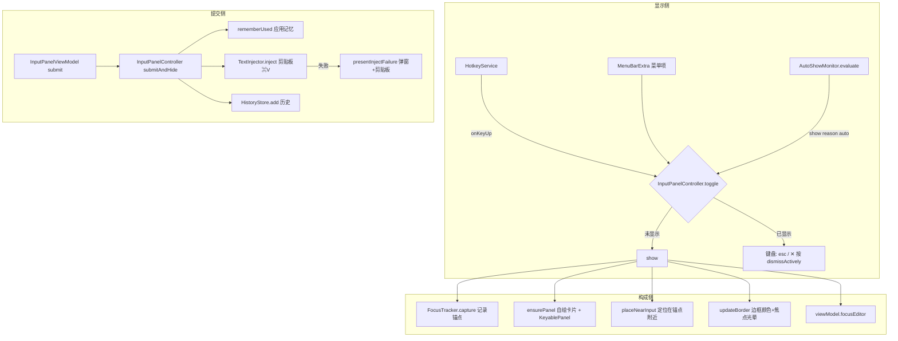

# 输入小窗领域知识库

## §0 文档索引

| § | 标题 | 定位 |
|---|------|------|
| §1 | 业务背景与核心概念 | 首次接触该域时读 |
| §1.5 | 架构概览 | 快速建立分层认知（mermaid 图） |
| §2 | 小窗生命周期与显隐决策 | 理解主流程与状态 |
| §2.5 | 物理路径速查 | 直接定位代码目录 |
| §3 | 代码入口索引 | 按任务场景找入口 |
| §4 | 状态与数据字段入口索引 | 改界面状态、偏好时 |
| §5 | 事件与监听入口索引 | 改事件驱动逻辑时 |
| §6 | 核心业务规则与隐性约束 | 改代码前必扫的 AI 易错点 |
| §7 | 常见易忽略条件与验证路径 | 改完后如何验证 |
| §8 | 关联文档 | 跨域联读指引 |
| §9 | 覆盖度与待补充项 | 置信度与缺口 |

## §1 业务背景与核心概念

OpenInput（智能输入小窗）为 macOS 单行输入框提供舒适的多行编辑体验。本域是小窗本体：菜单栏常驻（LSUIElement，无 Dock 图标），通过全局热键 `⌥⌘I`、菜单栏或按应用记忆自动呼出；隐藏时无窗口，显示时是一个无边框浮动输入面板，编辑完成按 Return 将文本注入回原输入框。

核心概念：

- **面板（Panel）**：`KeyablePanel`，继承 `NSPanel`，`canBecomeKey = true` 且 `canBecomeMain = false`。Maccy/SaneClip 模式的典型实现——不激活应用本身也能接收键盘输入。
- **小窗卡片（card）**：面板内的自绘圆角卡片，承载 `NSHostingView` 与自绘边框。
- **锚点（anchorRect）**：`FocusTracker.captured?.anchorRect`，面板定位的依据（AX 光标或鼠标位置）。
- **ShowReason**：`manual`（热键/菜单栏）与 `autoShow`（记忆自动弹出），影响显示时机的细节和抑制窗时长。
- **抑制窗（suppressAutoHideUntil）**：显示后的一小段时间内容忍失去焦点，不立即隐藏（防闪烁）。

## §1.5 架构概览

## §2 小窗生命周期与显隐决策

### 显隐状态机

面板不维护显式状态枚举，用 `panel?.isVisible` + 抑制窗（`suppressAutoHideUntil`）+ 焦点态组合表达。核心方法都在 `InputPanelController`：

| 状态 | 进入方式 | 说明 |
|---|---|---|
| 隐藏 | 启动 / `hide` | `panel?.orderOut(nil)` |
| 显示中 | `show(reason:)` | `orderFrontRegardless` + `makeKey` + focus |
| 提交中 | `submitAndHide` | 注入文本异步执行中 |
| 失焦保护期 | 显示后 | `suppressAutoHideUntil` 之内不自动隐藏 |

### 关键分支（show 的完整时序）

1. `show(reason:)`：若已可见直接返回；先 `FocusTracker.shared.captureFrontmost()` 记录本次目标应用与锚点。
2. `ensurePanel()`：首次则创建 `KeyablePanel` + 卡片层级 + 绑定 `BorderOverlayView`。**关键**：面板 styleMask 必须含 `.nonactivatingPanel`（失去 `init` 时设置则无法存活，需重建）。
3. `applySize(panel)` → `placeNearInput(panel)`：定位在锚点附近（见 §6 规则 3）。
4. `updateBorder()` → `panel.level = .floating` → `panel.orderFrontRegardless()` → `panel.makeKey()` → `focusEditor(force: true)` → `installAutoHideMonitors()`。
5. `auto` 模式下额外 `asyncAfter(0.05s)` 再 `orderFront + makeKey + focus`（Chrome 等应用时序补偿）。

### 隐藏三分支

| 分支 | 触发 | 行为 |
|---|---|---|
| `dismissActively` | esc / 关闭按钮 / 热键再次 toggle | 记录记忆 `rememberDismissed` + `suppress` 2s + hide 不清文本 |
| `dismissPassively` | 切换应用 / 点击面板外 | 不动记忆，`suppress` 1.2s + hide 不清文本 |
| `hide(clearText:)` | 以上两者的共通收尾 | 拆监听、清/留文本、隐藏 |

提交路径：`submitAndHide()` → 文本为空直接 dismissActive；否则记录 `rememberUsed`（应用记忆）+ 异步 `TextInjector.inject` + 成功写 `HistoryStore`，失败弹 Alert（文本已在剪贴板兜底）。

### 自动隐藏监听

- `installAutoHideMonitors`（显示时安装）：`NSWorkspace.didActivateApplicationNotification` + 全局鼠标点击监测。
- 命中条件：`isVisible` && 已过 `suppressAutoHideUntil` && 目标不是本应用 → `dismissPassively`。
- `windowDidResignKey`：延迟 150ms 复核（前台非本应用才关）。

## §2.5 物理路径速查

| 目录（相对项目根） | 内容 | 关键类/文件数 |
|---|---|---|
| `OpenInput/UI/InputPanel/` | 面板控制器与视图 | InputPanelController.swift / InputPanelView.swift |
| `OpenInput/UI/Settings/` | 设置窗口各页签 | SettingsView.swift / AutoShowSettingsView.swift |
| `OpenInput/Services/` | 焦点捕获/注入/历史/偏好/自动弹出/热键 | 8 个 Swift 文件 |
| `OpenInput/Models/` | 数据模型 | AppPreferences.swift |
| `OpenInput/App/` | 入口与生命周期 | AppDelegate.swift / OpenInputApp.swift |

## §3 代码入口与行为索引

| 场景 | 入口 | 类/方法 | 说明 |
|---|---|---|---|
| 呼出/切换小窗 | `AppDelegate.applicationDidFinishLaunching` | `HotkeyService.start` | 注册 ⌘⌥I 回调，内部 `DispatchQueue.main.async` 桥回 |
| 显示小窗 | `InputPanelController.show(reason:)` | `KeyablePanel` 创建 + 定位 | reason: `.manual` / `.auto` |
| 提交文本 | `InputPanelViewModel.submit` | `InputPanelController.submitAndHide` | 空文本走 dismiss；注入成功才写历史 |
| 取消/关闭 | `InputPanelViewModel.cancel` | `InputPanelController.dismiss` | esc / ✕ 按钮 |
| 全局热键设置 | `SettingsView.ShortcutsSettingsView` | `KeyboardShortcuts.Recorder` | `togglePanel` 默认 `⌥⌘I` |
| 菜单栏 | `AppDelegate` | `MenuBarExtra` | 菜单项走 `requestTermination` 允许真退出 |

## §4 状态与偏好字段入口索引

| 字段 | 宿主 | 业务语义 | 改动注意 |
|---|---|---|---|
| `ShowReason` | `InputPanelController` | manual/autoShow | 影响 suppress 时长 |
| `suppressAutoHideUntil` | `InputPanelController` | 失焦保护时间窗 | 改小会闪，改大响应慢 |
| `panel.isVisible` | 面板 | 可见性事实源 | 不要用 window 属性判断 |
| `windowFrame` | `PreferencesStore` | 面板 frame 持久化 | 移动/改变尺寸用 `windowDidMove`/`windowDidResize` 回调保存 |
| 边框/透明度 | `PreferencesStore` | `panel.borderColor`/`panel.panelOpacity` | 修改后必须 `updateBorder()` |

## §5 事件与监听入口索引

| 类型 | 标识 | 代码入口 |
|---|---|---|
| 全局热键 | `KeyboardShortcuts.Name.togglePanel` | `HotkeyService` |
| 面板显示隐藏 | `InputPanelController.show/hide/dismiss*` | show/hide/dismiss |
| 应用切换 | `NSWorkspace.didActivateApplicationNotification` | `InputPanelController` windowDidResignKey + 监视 |
| 鼠标点击 | 全局鼠标事件监视 | `InputPanelController` |

## §6 核心业务规则与隐性约束

- 【禁止】在 Carbon/AX 回调或全局监视回调里直接用 `Task { @MainActor }` —— Carbon 派发线程不在 MainActor executor 下，Swift 6 会 SIGSEGV。必须 `DispatchQueue.main.async` 桥回（见 `HotkeyService` 注释）。
- 【禁止】修改 `panel` 的 `styleMask` 后直接复用 panel——非 activating 属性必须在 init 时传入，改 styleMask 无效（见 `ensurePanel` 重建逻辑）。
- 【隐性依赖】显示前必须先 `FocusTracker.captureFrontmost()` ——否则 `anchor` 为 nil，`placeNearInput` 退化到鼠标位置。
- 【隐性】`placeNearInput`：锚点宽度 >280（Chrome 地址栏等）会 `pinchWide` 收敛到鼠标附近；面板优先显示在锚点下方、屏幕内，超出屏幕则翻到上方。
- 【AI 易错点】`NSTextView` 的 `doCommand` 回调里键盘事件处理顺序是有优先级的（见下方「快捷键行为」）——按 Return 提交前先判断 `textView.hasMarkedText()`（输入法组合未完成时不能提交）。
- 【AI 易错点】面板隐藏后必须重置 `lastAutoShowAt`/应用记忆联动——连续显示记录会触发误判（见 AUTO_SHOW KB §6）。
- 【叫法统一】「面板」= `KeyablePanel`/`InputPanelController`；「输入框」= `InputTextViewRepresentable` 内的 NSTextView；「卡片」=自绘 card view。

### 待确认的锚点行为（长输入框）

- 锚点选在鼠标附近（`pinchWide`）是启发式，不同应用下结果不一定贴合输入光标。
- 多个显示器时定位使用屏幕框架的 `visibleFrame`，不处理跨屏重合的临时策略。

## §7 常见易忽略条件与验证路径

- 改显示逻辑后：`xcodebuild -scheme OpenInput -configuration Debug` 编译成功后 `open .doc-init-dd/Build/Products/Debug/OpenInput.app`，按 `⌘⌥I` 应出现 400x180 浮动面板。
- 改定位逻辑后：对任意应用输入框调用 `capture`，确认面板贴锚点（上方优先；浏览器宽地址栏收敛到鼠标）。
- 改隐藏逻辑后：显示面板后点击面板外空白 → 面板应在 0.35~1.2s 抑制窗后消失；打开设置页多一点控制。
- 注意：面板定位依赖运行时的锚点；没有辅助功能权限时退化为鼠标位置，行为与授权后不同。

## §8 关联文档

- [焦点捕获与文本注入知识库](FOCUS_INJECTION_KNOWLEDGE_BASE.md)：面板锚点来源、⌘V 注入时序。
- [自动弹出知识库](AUTO_SHOW_KNOWLEDGE_BASE.md)：显示触发源与抑制策略。
- [历史记录知识库](HISTORY_KNOWLEDGE_BASE.md)：历史浏览（面板内历史弹窗）。
- [偏好设置知识库](PREFERENCES_KNOWLEDGE_BASE.md)：边框颜色、透明度、窗口尺寸。
- [Accessibility 机制 Guide](ACCESSIBILITY_GUIDE.md)：焦点锚点、AX 坐标转换。
- [运行与验证 Guide](OPERATIONS_GUIDE.md)：构建安装启动日志。

## §9 覆盖度与待补充项

- 覆盖：显隐状态机、定位、焦点态（`BorderOverlayView`）、提交/取消分流。
- 未覆盖：自动弹出的触发判定细节（详见 AUTO_SHOW KB）。
- 待补充：真实设备上对 Chrome/Finder 等应用的锚点定位效果（需要有运行时验证截图）。

<!-- 该文档由 doc-init 生成于 2026-08-08；定位：AI 修改小窗生命周期/显隐/定位/编辑器行为时快速参考 -->