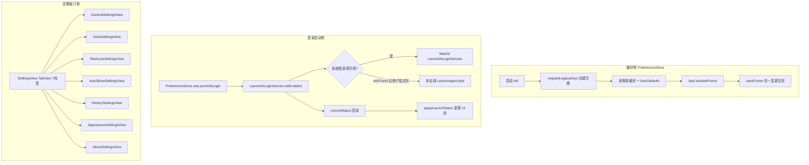

# 偏好设置领域知识库

## §0 文档

| § | 标题 | 定位 |
|---|------|------|
| §1 | 业务背景与核心概念 | 首次接触该域时读 |
| §1.5 | 架构概览 | 快速建立分层认知（mermaid 图） |
| §2 | 偏好存储核心流程 | 理解迁移与读写 |
| §2.5 | 物理路径速查 | 直接定位代码目录 |
| §3 | 代码入口索引 | 按任务场景找入口 |
| §4 | 偏好键字段索引 | 改偏好时必看 |
| §5 | 登录启动注册索引 | 改登录项时 |
| §6 | 核心业务规则与隐性约束 | 改代码前必扫的 AI 易错点 |
| §7 | 常见易忽略条件与验证路径 | 改完后如何验证 |
| §8 | 关联文档 | 跨域联读指引 |
| §9 | 覆盖度与待补充项 | 置信度与缺口 |

## §1 业务背景与核心概念

全局偏好设置是 OpenInput 的唯一设置真相来源：外壳边框颜色、透明度、窗口尺寸、插入方式、自动空格、登录启动、窗口位置，以及语音听写相关项。偏好存 `UserDefaults.standard`（`com.x0c.openinput` 域），旧版无前缀键名在启动时一次性迁移到新键。

核心概念：

- **偏好键（PreferencesKeys）**：静态常量集，点分命名 `域.键`（`panel.*` / `insertion.*` / `general.*` / `voice.*`），默认值成对声明（`*Default`）。
- **登录启动注册（LaunchAtLoginService）**：签名应用的主路径走 MacKit 的系统登录项三态；ad-hoc / DerivedData Debug 构建只有用户显式开启时才在本应用内写 LaunchAgent plist。待批准不能显示成已开启。
- **菜单栏图标显隐**：`menuBar.iconVisible`，键不存在 = 显示。隐藏后必须出示恢复主窗口，输入小窗不能当恢复面。详见 [菜单栏、隐藏图标与恢复窗口](MENU_BAR_LIFECYCLE_GUIDE.md)。
- **设置窗口**：`SettingsView` 七个页签（通用 / 语音 / 快捷键 / 自动弹出 / 历史 / 外观 / 关于）。恢复主窗口是另一个带标题的小窗，不是这七页。

## §1.5 架构概览

## §2 偏好存储核心流程

### 读写路径

- 读取 + 写入：`PreferencesStore` 的 `didSet` 写 `UserDefaults`；启动时从 `UserDefaults` 读。
- `panel.paneOpacity` 写入前 `clampOpacity(0.35...1.0)`，读出也 clamp。
- `windowFrame` 用 `CodableRect`（JSON data）存 `panel.windowFrame`；读取失败回退默认尺寸。

### 旧键迁移（migrateLegacyKeys）

`PreferencesStore.init` 首先迁移，然后 `PreferencesStore` 才会读。映射表（旧 → 新）：

| 旧键（无前缀） | 新键 |
|---|---|
| `borderColor` | `panel.borderColor` |
| `panelOpacity` | `panel.opacity` |
| `defaultWindowSize` | `panel.defaultSize` |
| `insertionMethod` | `insertion.method` |
| `autoAddSpaces` | `insertion.autoSpaces` |
| `launchAtLogin` | `general.launchAtLogin` |
| `windowFrame` | `panel.windowFrame` |

迁移语义：新键不存在且旧键存在 → 旧值搬运到新键并删除旧键（幂等）。

AppMemoryStore 同样有旧键迁移（`autoShowMasterEnabled` → `appMemory.autoShowMaster`）。

## §2.5 物理路径速查

| 目录（相对项目根） | 内容 | 关键类/文件数 |
|---|---|---|
| `OpenInput/Services/PreferencesStore.swift` | 偏好与迁移、登录启动联动 | PreferencesStore |
| `OpenInput/Services/LaunchAtLoginService.swift` | MacKit 主路径 + 本应用 LaunchAgent 回退 | LaunchAtLoginService |
| `OpenInput/Services/AppMemoryStore.swift` | 自动弹出记忆偏好 | `appMemory.autoShowMaster` |
| `OpenInput/UI/Settings/SettingsView.swift` | 设置窗口七页签 | SettingsView |
| `OpenInput/UI/Recovery/RecoveryWindowView.swift` | 隐藏图标后的轻量恢复主窗口 | RecoveryWindowView |
| `OpenInput/UI/Settings/VoiceSettingsView.swift` | 语音页签 | VoiceSettingsView |

## §3 代码入口索引

| 场景 | 入口 | 类/方法 | 说明 |
|---|---|---|---|
| 读/写偏好 | 任何需要偏好的模块 | `PreferencesStore.shared.xxx` | @Observable 可绑定 |
| 启动时初始化 | `AppDelegate.applicationDidFinishLaunching` | `_ = PreferencesStore.shared` | 触发迁移+登录启动 |
| 修改登录启动 | 菜单 / 恢复窗口 / 设置页 Toggle | `PreferencesStore.setLaunchAtLogin` | 待批准时打开系统登录项，不把开关显示成开 |
| 登录启程刷新 | 启动/设置页/恢复窗口 appear | `syncLaunchAtLoginFromSystem` | 回读系统状态 |
| 菜单栏图标显隐 | 菜单 Hide / 恢复窗口 Show | `PreferencesStore.menuBarIconVisible` | 键不存在 = 显示；**隐藏当下禁止弹恢复窗**，再次打开或「打开主窗口」才出示 |
| 打开设置窗口 | 菜单栏 `SettingsLink` | `SettingsView` | 七页签 |
| 打开恢复主窗口 | 菜单 Open Main Window / 再次打开 | `RecoveryWindowController.show` | 带标题，点外面不关 |

## §4 偏好键字段索引

| 键（域.名） | 默认值 | 类型 | 语义 | 注意 |
|---|---|---|---|---|
| `panel.borderColor` | `.blue` | string enum | 边框颜色 | 8 色（BorderColorOption）|
| `panel.opacity` | `1.0` | Double | 面板不透明度 | clamp 0.35...1.0 |
| `panel.defaultSize` | `.regular` | string enum | 默认窗口尺寸 | compact/regular/large |
| `panel.windowFrame` | 默认尺寸 | JSON | 面板 frame 记忆 | CodableRect 编码 |
| `insertion.method` | `.paste` | string enum | 注入方式 | typing 未启用 |
| `insertion.autoSpaces` | `false` | Bool | 自动加空格 | 未启用（控件 disabled）|
| `general.launchAtLogin` | `false` | Bool | 登录启动偏好 | 界面以系统真实状态为准；待批准时开关为关 |
| `menuBar.iconVisible` | `true`（键不存在也是显示） | Bool | 是否显示菜单栏图标 | 用键是否存在判断，禁止把空当成关 |
| `appMemory.autoShowMaster` | `true` | Bool | 自动弹出总开关 | 独立于 PreferencesKeys |
| `appMemory.apps` | — | JSON 文件 | 应用级记忆 | 见 AUTO_SHOW KB |
| `voice.autoStartOnShow` | `false` | Bool | 下次唤出是否自动听写 | 与小窗麦克风按钮共用同一事实 |
| `voice.locale` | `""` | String | 听写语言 | 空=跟随系统 |
| `voice.autoRefine` | `true` | Bool | 提交时尝试端侧校对 | 连续失败会自动关掉 |
| `voice.replacements` | `[]` | JSON | 听写替换词 | `VoiceReplacement` 数组 |

### 设置页各页签（SettingsView）

- **通用**：显示菜单栏图标 Toggle、登录项 Toggle（待批准时关着并引导去系统设置）、窗口尺寸选择器（切换时 `resetWindowSizeToDefault`+`updateBorder`）、注入方式 Picker（disabled）、自动空格 Toggle（disabled）、辅助功能权限条 + 打开设置按钮。
- **语音**：下次自动听、麦克风授权状态、听写语言、提交时顺手清理、用户替换词。旧系统上听写相关控件灰掉。详见 [语音听写知识库](VOICE_INPUT_KNOWLEDGE_BASE.md)。
- **快捷键**：全局热键 `⌥⌘I` 录制器（`ShortcutsSettingsView` ← 面板内快捷键说明）。
- **自动弹出**：总开关 + 权限状态 + 已记忆应用列表（逐条开关 / 移除 / 清空）。
- **历史**：搜索 + 多选删除 + 清空 + 导出（无）。
- **外观**：边框颜色单选（8 色）+ 透明度滑杆 35%~100%。
- **关于**：应用图标 / 名称 / 版本（读 Info.plist）/功能描述。

## §5 登录启动注册表

| 机制 | 条件 | 行为 |
|---|---|---|
| MacKit `LaunchAtLoginService` | 系统登录项不是 `.notFound` | 系统三态：开 / 关 / 待批准。待批准不能显示成已开启。 |
| LaunchAgent | 仅 ad-hoc/Debug 且用户显式打开 | 写 `~/Library/LaunchAgents/com.x0c.openinput.launchagent.plist` + `launchctl bootstrap gui/<uid>`。不进公共库。 |
| 状态回读 | 任意 | MacKit 三态；若系统是关且本机已有 LaunchAgent，才视为开 |

**关键安全逻辑**：`setEnabled(false)` 先 `unregister`（若 enabled/needsApproval）再删 LaunchAgent；失败时偏好回滚为 false 并显示错误文案。

**ad-hoc 构建的自动补装被禁止**（`refreshIfNeeded` 只在已有 plist 时刷新程序路径，绝不替 ad-hoc 构建自动新建——注释：会孵化多个卡死副本）。

## §6 核心业务规则与隐性约束

- **AI 易错点**：新增偏好必须成对加键 + 默认值（`PreferencesKeys` + `*Default`），禁止使用处散落字面量；键名「域.名」。
- **AI 易错点**：用户可见文案 / 颜色 / 尺寸等分类枚举必须进 `*Option`（本地化 displayName），不要硬编码中文或色值。
- 【禁止】直接改 `preferences.launchAtLogin` Bool——必须走 `setLaunchAtLogin`/`syncLaunchAtLoginFromSystem`，否则 UI 与系统状态脱节。
- 【禁止】把待批准显示成已开启；开关只在系统真正会拉起时为开。
- 【禁止】替 ad-hoc Debug 自动重装 LaunchAgent。
- 【禁止】新增偏好时漏掉 `menuBar.iconVisible` 的「键不存在 = 显示」。
- 【隐性依赖】`PreferencesStore.shared` 必须在任何偏好读取前初始化一次（AppDelegate 已做）——`private init` 里执行迁移，绕过多实例会用默认值。
- 【隐性】无启动注册 AUTO：`(autoAddSpaces) / (insertion.method=typing)` 在 UI 是 disabled，逻辑未启用——改设置页前先读这里，不要让 AI 误以为能用。
- 【隐性】窗口尺寸切换 (`defaultWindowSize`) 时立即 `resetWindowSizeToDefault` 重置窗位 —— 不改偏好则窗口仍保持记忆 frame。
- 【叫法统一】偏好主称谓 = `PreferencesStore`；「登录启动」= LaunchAtLoginService；「自动弹出记忆」单独在 AppMemoryStore，**不要**与偏好库混淆。

## §7 常见易忽略条件与验证路径

- 验证迁移：曾用旧版（无前缀键）的用户启动后 `defaults read com.x0c.openinput` 应该只有新键、旧键消失。
- 验证登录启动：勾选后 `launchctl print gui/$UID | grep openinput` 应出现 service；取消勾选后卸载。
- 验证设置持久化：改边框颜色 / 透明度 / 听写开关 → 重启应用 → 值保留。
- 文件位置：`~/Library/Preferences/com.x0c.openinput.plist`（preferred domain）、`~/Library/Application Support/OpenInput/`（历史+应用记忆 JSON）。

## §8 关联文档

- [语音听写知识库](VOICE_INPUT_KNOWLEDGE_BASE.md)：`voice.*` 键的行为与降级。
- [输入小窗知识库](INPUT_PANEL_KNOWLEDGE_BASE.md)：边框/透明度/尺寸消费方。
- [自动弹出知识库](AUTO_SHOW_KNOWLEDGE_BASE.md)：应用记忆与总开关。
- [Accessibility 机制 Guide](ACCESSIBILITY_GUIDE.md)：权限状态条。
- [菜单栏、隐藏图标与恢复窗口](MENU_BAR_LIFECYCLE_GUIDE.md)：隐藏图标、恢复主窗口、开机自启三态；输入小窗不能当恢复面。

## §9 覆盖度与待补充项

- 覆盖：迁移、全部键（含 `voice.*` 与 `menuBar.iconVisible`）、MacKit 主路径 + 本应用 LaunchAgent 回退、设置页七页签、ad-hoc 防重装、待批准不显示成已开启。
- 待补充：未签名构建下 LaunchAgent 回退需在 Mac 上运行时验证。
- 待确认：`InsertionMethod` 后续是否会启用 typing（当前 disabled）。

<!-- 该文档整理/压缩于 2026-09-05 -->
