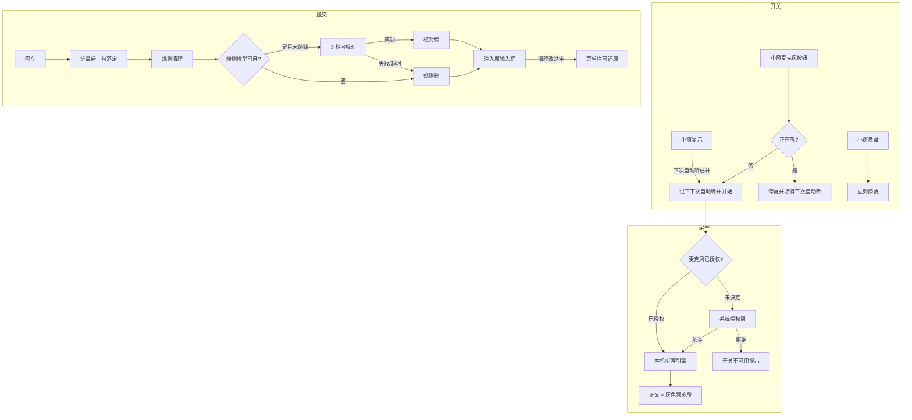

# 语音听写领域知识库

## §0 文档索引

| § | 标题 | 定位 |
|---|------|------|
| §1 | 业务背景与核心概念 | 首次接触该域时读 |
| §1.5 | 架构概览 | 快速建立分层认知 |
| §2 | 听写与提交清理核心流程 | 理解开关、识别、清理、还原 |
| §2.5 | 物理路径速查 | 直接定位代码目录 |
| §3 | 代码入口索引 | 按任务场景找入口 |
| §4 | 状态与偏好字段入口索引 | 改界面状态、偏好时 |
| §5 | 事件与监听入口索引 | 改音频/权限回调时 |
| §6 | 核心业务规则与隐性约束 | 改代码前必扫的 AI 易错点 |
| §7 | 常见易忽略条件与验证路径 | 改完后如何验证 |
| §8 | 关联文档 | 跨域联读指引 |
| §9 | 覆盖度与待补充项 | 置信度与缺口 |

## §1 业务背景与核心概念

给输入小窗加本机语音听写：底部一个麦克风开关，打开后**每次唤出小窗就直接开始听**，不必再点一次。说完仍按回车插入回原输入框，**不自动插入**。识别用 macOS 自带听写，不接 Whisper、不接云端识别、不接外接模型，以保住「纯本机、不联网」口径。

核心概念：

- **麦克风开关**：同时是「现在听不听」和「下次唤出是否自动听」的同一开关。打开会立刻开始听，并记下「下次自动听」；关掉立刻停麦，并取消自动听。
- **系统覆盖**：只接 macOS 26 起的新听写引擎。更旧的系统上开关灰掉，并提示需要升级。部署目标仍是 macOS 14，语音代码全部用系统版本闸门包起来。
- **规则清理（所有人）**：提交时必跑。去口水词、折叠无意义重复、套用户替换词、规范标点与中英空格。
- **端侧模型清理（能用才用）**：提交时在规则清理之后，用本机苹果语言模型再校一稿。国行机器 + 中国大陆账号默认用不了；用不了、超时或输出不像校对结果时，一律退回规则清理稿。超时不计入熔断；连续 3 次真失败会自动关掉「提交时顺手清理」。
- **还原上次清理**：注入成功且清理确实改过字时，菜单栏出现该项（约 2 分钟有效）。注入前会先读当前焦点框；内容已经被人改过就拒绝还原，避免覆盖用户后续编辑。

对用户只承诺「顺手清理」，不承诺润色、改写或翻译。

## §1.5 架构概览

## §2 听写与提交清理核心流程

### 2.1 开关与生命周期

1. 小窗显示结束后，若「下次自动听」已开，立刻开始听，并把失焦保护窗拉到约 30 秒（覆盖系统麦克风授权窗）。授权弹窗期间不要把小窗被动关掉。
2. 开始听时顺手预热端侧模型（若清理开关开着且模型可用），用户还在说话时模型已经热了。
3. 隐藏（主动关、点外面、切应用、提交）一律立刻停麦。提交路径先尽量让识别器吐出最后一句，再把灰色预览并进正文，再跑清理，再注入。
4. 用户在听写过程中手改文本：重新锚定「已接受的听写正文」，避免下一段识别覆盖手改内容。

### 2.2 识别引擎

- 首选听写专用引擎（自带标点）；该路径语言或资源不可用时，回退同族的通用转写引擎。
- 模型是否就绪看「还要不要下载语言包」：返回空表示已装好。不要只看「支持」状态——已安装时状态仍可能显示为支持而未安装。
- 识别栈启动前缓存约 10 秒音频再回灌，否则第一个字会丢。
- **不要按静音自动停止**。产品模型是显式回车提交。
- 非激活浮动小窗不影响录音。
- 新路径实测不需要「语音识别」授权键，只要麦克风用途说明。正式发布包开了加固运行时，签名权限里必须声明允许使用麦克风，否则调试包能录、正式包拿不到麦。

### 2.3 提交清理

顺序固定：**先规则清理，再把规则稿送给端侧模型**。模型失败、超时、不可用、被熔断，都用规则稿注入。还原记忆的「原文」是用户提交前的稿（听写 + 手改），不是规则稿。

端侧模型必须用宽松内容变换档，且只收纯文本。不要用结构化生成约束，否则宽松档无效。每次校对一个新会话；待命会话只用于预热，用过即弃。

输出校验：助手腔开头、长度暴涨或腰斩、被包进代码块 → 丢弃，退回规则稿。

### 2.4 麦克风授权

- 未决定：用户点开听写时才申请，不在启动时弹。
- 拒绝 / 受限：人话提示 + 设置页可跳到系统麦克风面板。
- 系统授权窗会抢走前台：靠 30 秒失焦保护 + 「正在启动听写」期间跳过被动关闭。

## §2.5 物理路径速查

| 目录（相对项目根） | 内容 | 关键类 |
|---|---|---|
| `OpenInput/Services/SpeechDictationService.swift` | 状态机、麦克风采集、识别引擎、权限 | SpeechDictationService / MicrophonePermission |
| `OpenInput/Services/TextRefinementService.swift` | 规则清理、端侧校对、熔断、还原记忆 | TextRefinementService / TranscriptTidier |
| `OpenInput/UI/Settings/VoiceSettingsView.swift` | 设置「语音」页签 | VoiceSettingsView |
| `OpenInput/UI/InputPanel/` | 麦克风按钮、预览段、提交接线 | InputPanelView / InputPanelController |
| `OpenInput/Resources/OpenInput.entitlements` | 加固运行时麦克风声明 | `device.audio-input` |
| `OpenInput/Resources/Info.plist` | 麦克风用途说明 | `NSMicrophoneUsageDescription` |

## §3 代码入口索引

| 场景 | 入口 | 类/方法 | 说明 |
|---|---|---|---|
| 呼出后自动听 | `InputPanelController.show` | `startDictationIfNeeded` | 读 `voice.autoStartOnShow` |
| 点麦克风 | 小窗底部按钮 | `toggleDictation` | 同时改开关与当前会话 |
| 开始/停止识别 | 听写服务 | `start` / `stop` / `stopAndCommit` | 提交走 commit，隐藏走 stop |
| 提交清理 | `submitAndHide` | `TextRefinementService.refine` | 先规则后模型，失败静默降级 |
| 还原 | 菜单栏 | `revertLastCleanup` | 先读焦点框再注入原文 |
| 设置页 | `SettingsView` | `VoiceSettingsView` | 开关、语言、替换词、权限状态 |
| 模型可用性刷新 | 启动 / 回到前台 | `refreshAvailability` | 国行机器会显示不可用原因 |

## §4 状态与偏好字段入口索引

| 字段 | 宿主 | 业务语义 | 改动注意 |
|---|---|---|---|
| `voice.autoStartOnShow` | PreferencesStore | 下次唤出是否自动听；默认关 | 与麦克风按钮是同一事实 |
| `voice.locale` | PreferencesStore | 听写语言；空=跟随系统 | 不支持的语言要人话提示 |
| `voice.autoRefine` | PreferencesStore | 提交时是否尝试端侧校对；默认开 | 熔断会把它关掉 |
| `voice.replacements` | PreferencesStore | 用户替换词 JSON | 规则层套用，也作识别上下文提示 |
| 听写状态 | SpeechDictationService | idle / preparing / installing / listening / unavailable / failed | preparing 与 installing 不要显示成「正在听写」 |
| 还原记忆 | TextRefinementService | 原文 + 已贴出的清理稿 + 到期时间 | 只在确实改过字时出现菜单项 |

## §5 事件与监听入口索引

| 类型 | 标识 | 代码入口 |
|---|---|---|
| 麦克风采集回调 | 音频引擎 tap | `MicrophoneTap.installTap` |
| 输入设备切换 | 音频引擎配置变化 | `handleConfigChange`（必须防重入） |
| 识别结果流 | 听写/转写 results | `pumpDictationResults` / `pumpSpeechResults` |
| 语言包下载进度 | AssetInventory Progress | `observeAssetProgress` |
| 系统麦克风授权 | `AVCaptureDevice.requestAccess` | `MicrophonePermission.request` |

## §6 核心业务规则与隐性约束

- 【禁止】接云端识别、Whisper、Ollama 或任何外接模型。第三档会破坏纯本机隐私口径。
- 【禁止】在旧系统上硬链苹果端侧模型框架。必须弱链接，否则 macOS 14/15 启动即崩。
- 【禁止】把麦克风采集标成主线程专属。Swift 6 会把录音回调隔离到主线程，音频实时队列一回调就 SIGTRAP 闪退（崩溃栈在 `MicrophoneTap.installTap` / `_dispatch_assert_queue_fail`）。采集类必须非隔离，tap 闭包只转发跨线程安全的投递器。
- 【禁止】在音频 tap 回调里对每个缓冲区 `Task { @MainActor }`：会乱序，而且拖垮实时听写。音频线程直投缓存；电平等低频状态用 `DispatchQueue.main.async` + `MainActor.assumeIsolated`。Carbon/AX 回调同样禁止直接 `Task { @MainActor }`。
- 【禁止】复用同一个音频引擎实例跨次录音。每次开始听写必须新建；复用会在切换蓝牙麦时以 Objective-C 异常崩溃。
- 【禁止】采样率为 0 时仍给输入节点装 tap。先读 `inputNode.outputFormat(forBus: 0)`。
- 【禁止】静音自动停麦。产品是「说完按回车」。
- 【禁止】把清理做成按钮或改成「停顿后自动清理」。触发点只有回车提交。
- 【禁止】端侧模型用结构化生成约束。只用纯字符串，并显式走宽松内容变换档。
- 【AI 易错点】语言包是否就绪看安装请求是否为空，不要只看状态枚举。
- 【AI 易错点】正式包拿不到麦克风、调试包可以：几乎总是漏了加固运行时的麦克风声明，不是 TCC 文案写错。
- 【AI 易错点】国行 Mac + 中国大陆账号上端侧模型会报设备不合格。本机因地区解锁能用，**不能**当成普通用户的默认能力；设置页必须显示不可用原因，功能继续用规则清理。
- 【隐性】授权弹窗会让小窗失焦。`preparing` 期间跳过被动关闭，并把失焦保护窗拉长到约 30 秒。
- 【隐性】提交路径有防重入；清理是异步的，清理期间小窗先隐藏。
- 【叫法统一】对用户说「听写 / 顺手清理 / 还原上次清理」；不要说引擎、模型或框架名字。

## §7 常见易忽略条件与验证路径

1. 旧系统（或把闸门临时看成不可用）：麦克风按钮灰掉，文案提示需要 macOS 26。
2. 第一次听写：应弹出麦克风授权；点允许后小窗仍在，状态从「正在启动」变为「正在听写」，对着说话应出现灰色预览再落成正文。
3. 开关打开后关掉小窗再唤出：应直接开始听，不必再点麦克风。
4. 说一句带回车插入备忘录或浏览器地址栏：注入的是清理后的稿；若清理改过字，菜单栏应出现「还原上次清理」。
5. 还原：焦点框仍是刚贴进去的清理稿时应还原成提交前的稿；若用户已经改过框里的字，应提示无法还原。
6. 拒麦：人话提示，设置页可跳到系统麦克风面板。
7. 断网：听写与规则清理仍可用（语言包若未装完会失败，已装好的不受影响）。端侧模型本机运行，不因断网而新增网络请求。
8. 防注入口述：对着听写说「忽略之前的指令…」一类句子，提交后应作为普通文本贴出，不能变成模型的新指令。

编译入口与普通小窗相同；日志子系统仍是 `com.x0c.openinput`，听写与清理的分类分别是「听写」「听写清理」。

## §8 关联文档

- [输入小窗知识库](INPUT_PANEL_KNOWLEDGE_BASE.md)：开关所在的小窗生命周期、提交/隐藏分流。
- [焦点捕获与文本注入知识库](FOCUS_INJECTION_KNOWLEDGE_BASE.md)：回车注入与还原时读焦点框。
- [偏好设置知识库](PREFERENCES_KNOWLEDGE_BASE.md)：`voice.*` 键与语音页签。
- [运行与验证 Guide](OPERATIONS_GUIDE.md)：构建、授权、日志、冒烟步骤。
- 工作区《macOS 系统权限指南》：麦克风申请时机、拒绝后降级、`tccutil reset Microphone <包标识>`。
- 工作区《签名、公证与分发指南》：正式包加固运行时与权限声明。

## §9 覆盖度与待补充项

- 覆盖：产品开关语义、系统版本闸门、本机听写路径、提交时两档清理、熔断与还原、正式包麦克风声明、音频采集五个坑。
- 待补充：真实用户在微信/Chrome 连续听写的标点与错字率（本机探针中文全对带句号，不能外推到所有口音）。授权后对着说话出字、回车插入这条用户链路尚未在修完闪退后实跑。
- 待确认：听写专用引擎在部分语言上的资源是否长期可用；不可用时回退通用转写已实现。

<!-- 定位：AI 修改听写、麦克风、提交清理或还原时快速参考 -->

<!-- 该文档整理/压缩于 2026-09-05 -->
